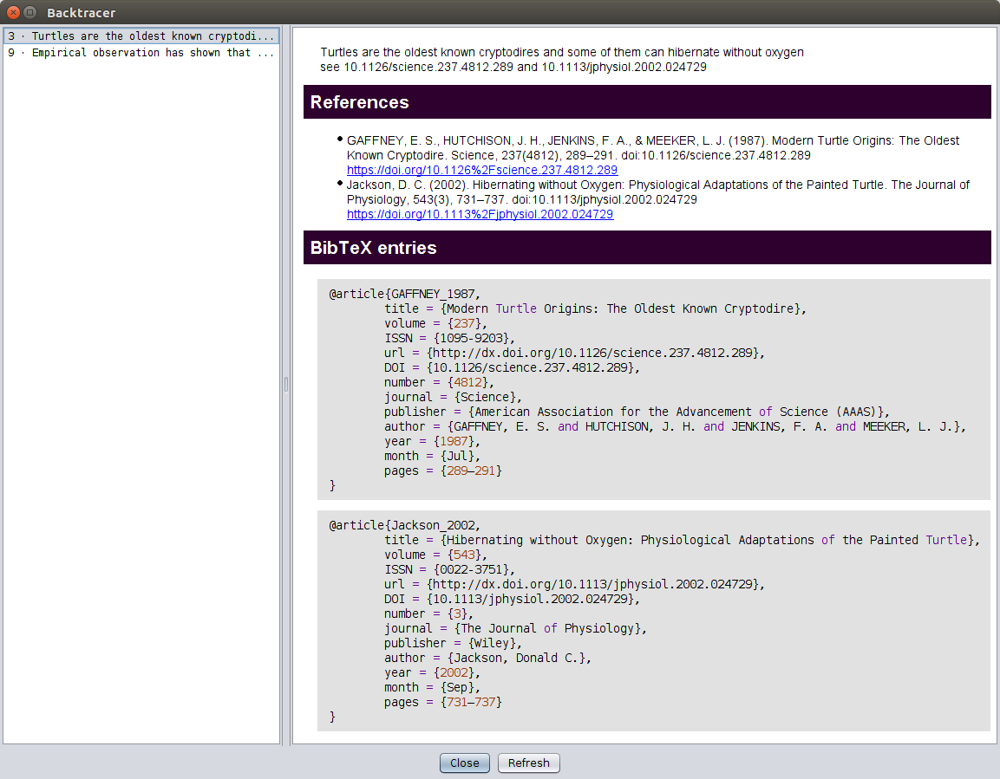

# The NetLogo Backtracer extension

A skeleton NetLogo extension, aiming to help NetLogo model authors make explicit the provenance of the data and theory used to build their models.


The need for such an extension was identified during the [Integrating Qualitative and Quantitative Evidence Using Social Simulation](https://www.lorentzcenter.nl/lc/web/2019/1116/info.php3?wsid=1116&venue=Snellius) workshop, organised by the [Qual2Rule ESSA special interest group](http://www.essa.eu.org/sig/sig-qual2rule/), that took place at the Lorentz Center in Leiden from April 8th to 12th, 2019.

## How to use it

Like any NetLogo extension, its usage needs to be declared at the top of the code tab:

```
extensions [ backtracer ]
```

The extension offers a few primitives (see below) but the main idea is that it makes NetLogo aware of the "snippets" you integrate in your code's comments to help trace the provenance of the data and computational rules that you used.

A "snippet" is defined as any piece of text appearing between the `<<` and `>>` delimiters. For example:

```
; << Empirical observation has shown that turtles tend to move forward. >>
to move
  ask turtles [ forward 1 ]
end
```

Once you compile your code, the backtracer button will appear in the code tab's toolbar. If you press that button, a pop up window will appear with a list of all the snippets contained in your code on the right and a panel showing the text of the selected snippet on the left.

Snippets can span multiple lines and include hyperlinks, which will be made clickable in the snippet display panel:

```
; <<
; Empirical observation has shown that turtles tend to move forward.
; This is confirmed by https://en.wikipedia.org/wiki/Turtle.
; >>
to move
  ask turtles [ forward 1 ]
end
```

Potentially more useful, the extension should be able to detect DOI in the snippets and retrieve citations and BiBTeX entries for them automatically. Suppose we have:

```
; <<
; Turtles are the oldest known cryptodires and some of them can hibernate without oxygen
; see 10.1126/science.237.4812.289 and 10.1113/jphysiol.2002.024729
; >>
```

You would get this in the backtracer popup window:



## Primitives

While those are not the main focus of the extension, a few primitives can be used to expose the underlying data:

### `backtracer:get-snippets`

Reports a list of strings containing the whole text of the snippets.

### `backtracer:get-urls`

Reports a list of all the URLs detected in the snippets.

### `backtracer:get-dois`

Reports a list of all the DOIs detected in the snippets.

### `backtracer:get-citations`

Reports a list of the formatted citations for the detected DOIs. (This queries https://doi.org and could take a while to run. It should time out after a few seconds if the site can't be reached.)

### `backtracer:get-bibtex`

Reports a string containing the BibTeX entries for the DOIs detected in the snippets. (This queries https://doi.org and could take a while to run. It should time out after a few seconds if the site can't be reached.)

## Conclusion

This is still very much a work in progress. What it does is limited and I expect the few bits of functionality it offers to be brittle and buggy. Still, it's a start and offers a glimpse of what it could become.

I'd like the community to be involved, though.

If you have ideas about this project, please do not hesitate to open [issues](https://github.com/nicolaspayette/backtracer/issues) in the repo or dump random thoughts in the [wiki](https://github.com/nicolaspayette/backtracer/wiki).
